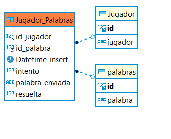

# PRUEBA Eiya 
## Realizada por Humberto montes de Oca <humbertoha18@gmail.com>

Prueba solicitada por parte de eiya
Productos utilizado
- Docker
- Yii2
- MySQL

## docker-compose file
```yaml
version: '3'

services:
  mysql:
    restart: always
    image: mysql:latest
    env_file:
      - ./.envs/.mysql
    volumes:
      - my-mysqlvolume:/var/lib/mysql
    ports:
      - "3306:3306"
    networks:
      - db-mysql
  php:
    image: yiisoftware/yii2-php:7.3-apache
    volumes:
      - ~/.composer-docker/cache:/root/.composer/cache:delegated
      - ./app:/app:delegated
    ports:
      - '8000:80'
    env_file:
      - ./.envs/.mysql
    depends_on:
      - mysql
    networks:
      - db-mysql
volumes:
  my-mysqlvolume:
networks:
  db-mysql:
    driver: bridge
```

## Base de datos



## Requerimientos

Esta prueba se construyo con docker-compose se necesita que este instalado 
enlace de descarga en 
windows 
https://desktop.docker.com/win/main/amd64/Docker%20Desktop%20Installer.exe
linux
Consulta la instalacion de tu distribucion

## Para empezar
```sh
git clone https://github.com/humbertoha/pruebawordle.git
cd pruebawordle
docker-compose up
```

# servicios api jugador obtiene palabra
peticion post con el jsonhttp://127.0.0.1:8000/index.php?r=wordle%2Findex
POST 
```json
{
"id_jugador":1
}
```

# servicios api jugador envia intento 
peticion post con el jsonhttp://127.0.0.1:8000/index.php?r=wordle%2Fturno
POST 
```json
{
"id_jugador":1,
"id_palabra":3,
"user_word":"beoqq"
}
```
# servicios api jugador envia intento 
peticion post con el jsonhttp://127.0.0.1:8000/index.php?r=wordle%2Findex
POST 
```json
{
"id_jugador":1
}
```